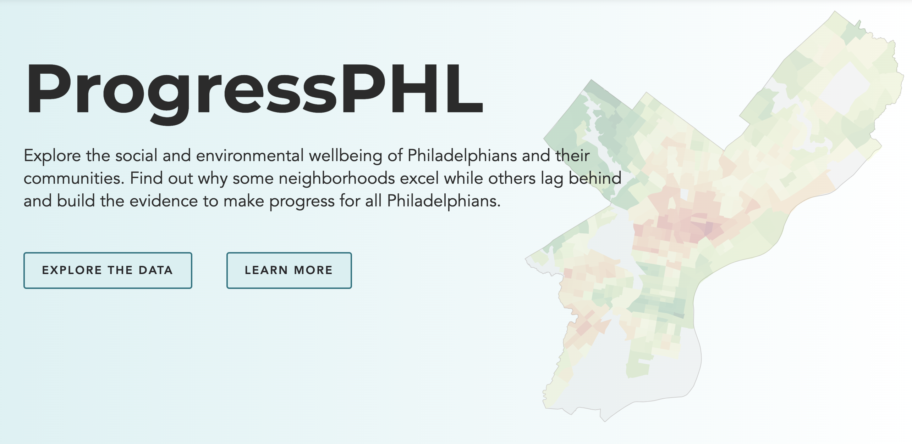

# The ProgressPHL Dashboard

The code behind the interactive ProgressPHL dashboard, hosted on the 
[Philadelphia City Controller's website](https://controller.phila.gov/philadelphia-audits/progressphl/#/
).

The dashboard is written in [Vue](https://github.com/vuejs
), uses [MapLibre GL JS](https://github.com/maplibre/maplibre-gl-js
 ) as its mapping platform, and leverages [d3 modules](https://github.com/d3
) throughout. 

